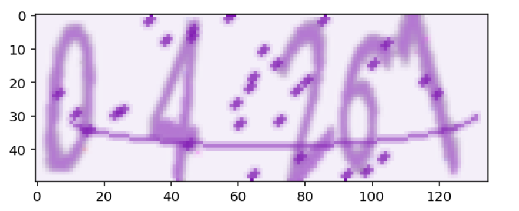

Cracking CAPTCHAs Using Deep learning
=====================================

Introduction
------------

The goal of the machine learning project is to test the security and suggest improvements to CAPTCHAs. To tackle this problem, we built a Convolutional Neural Network (CNN) to solve text-based CAPTCHAs. The final results inform decisions on whether text-based CAPTCHAs are useful in the current environment and which distortions are best for security.

Reverse Turing tests, or CAPTCHAs, are problems that are difficult for computers to solve but easy for people. They are used to differentiate humans from computers and prevent computers from accessing services created for humans; web services typically utilize them to avoid spamming, login by bots, brute forcing, scraping data and other unpleasant behaviors (Messina, 2022).

For our project, we decided to focus on text-based CAPTCHAs (randomly spaced letters or digits with some background noise) because they are ubiquitous on the web. They are commonly used because they are easy to create and deploy (Alqahtani & Alsulaiman, 2020). Various character distortions, such as different sizing, angles, fonts and warpings, are used to increase the complexity of the task. For our dataset, we are using coloured 5-digit CAPTCHAs from a publicly available CAPTCHA generator. An example of a CAPTCHA produced by the the generator is shown in Figure 1.

    Figure 1: An example of CAPTCHA in the selected dataset

.. note::
    The rest of the report will be added soon.

.. caution::
    This is not meant for use in a production; it has been submitted as a course project. 